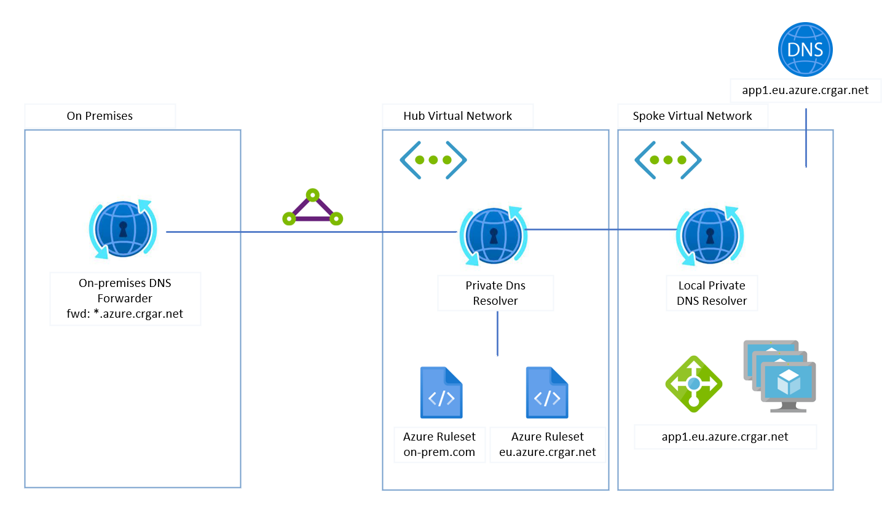

# Azure Dns Democratization
*REPO IN EARLY DEVELOPMENT STAGE*

## Problem statement
DevOps is a software development approach that promotes velocity and team autonomy. To achieve this, large organizations often look into their processes, identifying steps that are not optimal or that slow down innovation.

DNS is a service that is designed to be democratized and decentralized, but large or heavily regulated organizations may require close control over it.

Having a fully centralized DNS solution can create friction and limit the possibilities for teams to use modern techniques like blue-green deployments or disaster recovery in some situations.

This repository experiments with the idea of giving Application Teams the autonomy to manage their own DNS subdomains while maintaining full organizational control and strong auditing trails.

# Method 1: Local Private Resolver
## Architecture

## Explanation
First important thing to understand, is how does the resolver affects the standard DNS resolution in an Azure Vnet:

>A client in a virtual network issues a DNS query.
>1. If the DNS servers for this virtual network are specified as custom, then the query is forwarded to the specified IP addresses.
>1. If Default (Azure-provided) DNS servers are configured in the virtual network, and there are Private DNS zones linked to the same virtual network, these zones are consulted.
>1. If the query doesn't match a Private DNS zone linked to the virtual network, then Virtual network links for DNS forwarding rulesets are consulted.
>1. If no ruleset links are present, then Azure DNS is used to resolve the query.
>1. If ruleset links are present, the DNS forwarding rules are evaluated.
>1. If a suffix match is found, the query is forwarded to the specified address.
>1. If multiple matches are present, the longest suffix is used.
>1. If no match is found, no DNS forwarding occurs and Azure DNS is used to resolve the query.

Based on that:
1. The on-prem forwarder, forwards all queries to the Hub Resolver
1. The Hub Resolver has a ruleset that delegates the domain resolution to the Spoke resolver
1. The spoke VNet resoles using the Default Azure DNS, specified above. Private DNS zones will be considered to do the resolution
## Benefits
* On-prem DNS does not need any changes once initial set-up is done
* Support for auto registration of VMs
* Easy to configure and maintain
* No IaaS service required
* Cloud native services only
## Limitations you need to be aware of
* Forwarding rules per DNS forwarding ruleset: 25
* DNS forwarding rulesets per outbound endpoint: 2

# Method 2: Auto-registering Private DNS Zones into the HUB

[WIP]